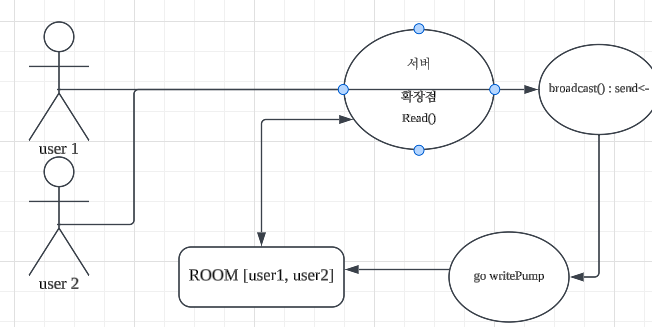

## 1. Client 생명주기 추가
- 기존에 Room에서 clients를 각 `*websocket.Conn`을 그대로 다루었지만, `Client` 구조체에서 클라이언트 정보를 취급 하도록 변경
```go
const (
	sendBuffer   = 16
	writeTimeout = 5 * time.Second
)

type Client struct {
	conn     *websocket.Conn
	room     *Room
	nickname string
	send     chan []byte
}

func NewClient(conn *websocket.Conn, room *Room, nickname string) *Client {
	return &Client{
		conn:     conn,
		room:     room,
		nickname: nickname,
		send:     make(chan []byte, sendBuffer),
	}
}

func (c *Client) Run(ctx context.Context) {
	c.room.Register(c)
	c.room.Broadcast(c.event(messages.TypeJoin, ""))

	done := make(chan struct{})
	go c.writePump(ctx, done)
	c.readPump(ctx)

	c.room.Unregister(c)
	close(c.send)
	<-done

	c.room.Broadcast(c.event(messages.TypeLeave, ""))
}

func (c *Client) readPump(ctx context.Context) {
	for {
		_, data, err := c.conn.Read(ctx)
		if err != nil {
			log.Printf("Cannot Connection Failed : %v", err)
			return
		}

		var in messages.Incoming
		if err := json.Unmarshal(data, &in); err != nil || in.Content == "" {
			log.Printf("Cannot Unmarshal : %v", data)
			continue
		}

		c.room.Broadcast(c.event(messages.TypeMessage, in.Content))
	}
}

func (c *Client) writePump(ctx context.Context, done chan<- struct{}) {
	defer close(done)

	for payload := range c.send {
		if err := c.write(ctx, payload); err != nil {
			log.Printf("Cannot Write Buffer : %v", payload)
			return
		}
	}
}

func (c *Client) write(ctx context.Context, payload []byte) error {
	writeCtx, cancel := context.WithTimeout(ctx, writeTimeout)
	defer cancel()
	return c.conn.Write(writeCtx, websocket.MessageText, payload)
}

func (c *Client) event(t messages.Type, content string) []byte {
	payload, err := json.Marshal(messages.Outgoing{
		Type:     t,
		Room:     c.room.name,
		Nickname: c.nickname,
		Content:  content,
		SentAt:   time.Now(),
	})
	if err != nil {
		log.Printf("cannot JSON Marshal : %v", err)
		return nil
	}

	return payload
}
```
- Run()이 room에 참가
- room.join()이 브로드zotmxm
- `writePump`를 별도 고루틴으로 띄우고 `readPump`를 블로킹 실행
- 연결 종료 시 leave()
- 기존 handleWS에 있던
	- ```go
	  for {
		conn.Read()
	  }
	  ```
	  루프를 `readPump()`와 `writePump`

### 2. room 변경
```go
type Room struct {
	name    string
	mu      sync.Mutex
	clients map[*websocket.Conn]struct{}
}

func (r *Room) Broadcast(ctx context.Context, payload []byte) error {
	r.mu.Lock()
	defer r.mu.Unlock()

	for c := range r.clients {
		if err := c.Write(ctx, websocket.MessageText, payload); err != nil {
			return err
		}
	}

	return nil
}
After =>
type Room struct {
	name    string
	mu      sync.Mutex
	clients map[*Client]struct{}
}

func (r *Room) Broadcast(payload []byte) error {
	r.mu.Lock()
	defer r.mu.Unlock()

	for c := range r.clients {
		c.send <- payload
	}

	return nil
}
```
- 기존 `conn.Write`를 room에서 사용하지 않고 c.send <- payload로 채널에 송신 -> `writePump`에서 채널 순회하며 버퍼 출력

## 3. 결과
```bash
서버
2026/07/29 13:17:22 방 생성 : lobby
2026/07/29 13:17:22 방 입장 : lobby
2026/07/29 13:17:22 [ROOM : lobby / USER : uho] : {"type":"join","room":"lobby","nickname":"uho","sentAt":"2026-07-29T13:17:22.276027411+09:00"}
2026/07/29 13:17:26 방 입장 : lobby
2026/07/29 13:17:26 [ROOM : lobby / USER : uho] : {"type":"join","room":"lobby","nickname":"lee","sentAt":"2026-07-29T13:17:26.246571201+09:00"}
2026/07/29 13:17:26 [ROOM : lobby / USER : lee] : {"type":"join","room":"lobby","nickname":"lee","sentAt":"2026-07-29T13:17:26.246571201+09:00"}
2026/07/29 13:18:38 [ROOM : lobby / USER : uho] : {"type":"message","room":"lobby","nickname":"uho","content":"Hello!","sentAt":"2026-07-29T13:18:38.286624272+09:00"}
2026/07/29 13:18:38 [ROOM : lobby / USER : lee] : {"type":"message","room":"lobby","nickname":"uho","content":"Hello!","sentAt":"2026-07-29T13:18:38.286624272+09:00"}
2026/07/29 13:19:01 [ROOM : lobby / USER : uho] : {"type":"message","room":"lobby","nickname":"lee","content":"Who r u??!","sentAt":"2026-07-29T13:19:01.014529008+09:00"}
2026/07/29 13:19:01 [ROOM : lobby / USER : lee] : {"type":"message","room":"lobby","nickname":"lee","content":"Who r u??!","sentAt":"2026-07-29T13:19:01.014529008+09:00"}

클라이언트 1
< {"type":"join","room":"lobby","nickname":"uho","sentAt":"2026-07-29T13:17:22.276027411+09:00"}
< {"type":"join","room":"lobby","nickname":"lee","sentAt":"2026-07-29T13:17:26.246571201+09:00"}
> {"content":"Hello!"}
< {"type":"message","room":"lobby","nickname":"uho","content":"Hello!","sentAt":"2026-07-29T13:18:38.286624272+09:00"}
< {"type":"message","room":"lobby","nickname":"lee","content":"Who r u??!","sentAt":"2026-07-29T13:19:01.014529008+09:00"}

클라이언트 2
< {"type":"join","room":"lobby","nickname":"lee","sentAt":"2026-07-29T13:17:26.246571201+09:00"}
< {"type":"message","room":"lobby","nickname":"uho","content":"Hello!","sentAt":"2026-07-29T13:18:38.286624272+09:00"}
> {"content":"Who r u??!"}
< {"type":"message","room":"lobby","nickname":"lee","content":"Who r u??!","sentAt":"2026-07-29T13:19:01.014529008+09:00"}
```

## 4. 서버 client.go 변경
- 현재 클라이언트가 TCP 연결을 4-way handshake없이 종료를 진행하면 EOF가 발생하는데 서버 측에서 Cannot Connection Failed를 발생시켰습니다 때문에 분기별로 로그 처리 수정
```go
_, data, err := c.conn.Read(ctx)
if err != nil {
	switch {
	case errors.Is(err, io.EOF), errors.Is(err, net.ErrClosed):
		log.Printf("client disconnected : %s", c.nickname)
	case websocket.CloseStatus(err) != -1:
		log.Printf("client close : %v", websocket.CloseStatus(err))
	default:
		log.Printf("read error : %v", err)
	}

	return
}
```
- EOF로 4-way handshake 없는 disconnection은 client disconnected
- 4-way handshake를 사용한 정상적인 disconnection은 client close
- 그 외의 비정상 read는 read error 로 로깅

```bash
2026/07/29 16:58:05 client close : StatusNoStatusRcvd
2026/07/29 16:58:05 [ROOM : lobby / USER : lee] : {"type":"leave","room":"lobby","nickname":"uho","sentAt":"2026-07-29T16:58:05.014268811+09:00"}
2026/07/29 16:58:09 client disconnected : lee
```

## 5. 구조
